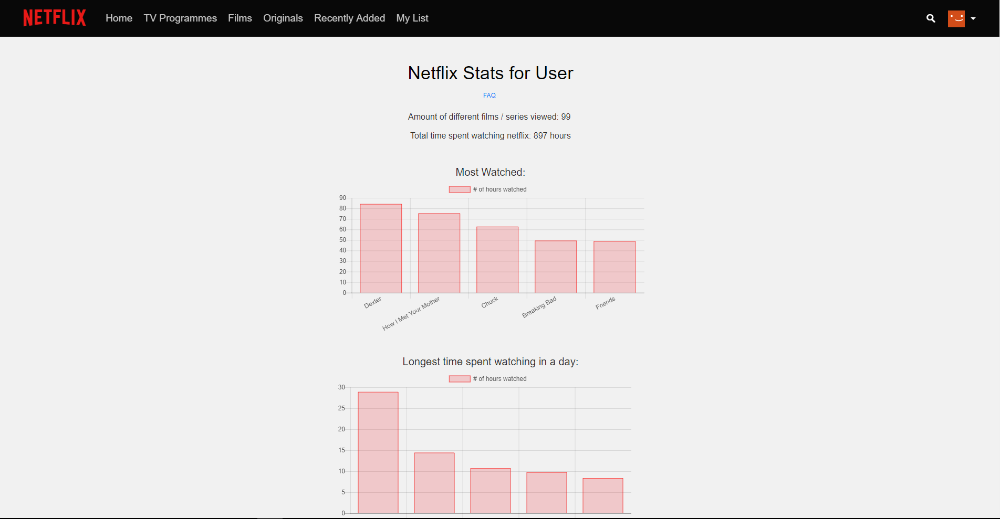

# NetflixStats

A small script that can extract and show you information about your watch history



# WARNING

Use of this software may constitute a breach in the [Netflix Terms of Use](https://help.netflix.com/legal/termsofuse) and/or the [End User License Agreement](https://help.netflix.com/legal/eula). Use at your own risk.

# Usage

 - Highlight and copy **ALL** the code below 

 ```javascript
javascript:var s=document.createElement("script");s.src="https://thatguywiththatname.github.io/NetflixStats/minified/NetflixStats.js",s.type="application/javascript",document.getElementsByTagName("head")[0].appendChild(s);void 0
```

 - Create a new bookmark in your browser, and where the URL goes, paste the code in
 - Name the bookmark whatever you want, maybe "NetflixStats"
 - Go to [your Netflix viewing activity](https://www.netflix.com/viewingactivity) 
 - Click the bookmark
 - If nothing happens, open your browsers console so you can see what is going on (F12 for Chrome, then click the "Console" tab). If there are any errors you will see them highlighted in red
 - If all went well, you should now see your watch history replaced with more information!

# Notes / FAQ

 - Netflix does not keep an accurate record of your watch history. If you skip credits or stop watching 3/4 of the way through something it can count it as a full watch. This means sometimes your longest watched day can be more than 24 hours.

# Developers

The DataGatherer.js file is run first, and creates a `flixStats` global object. At the end of the script, Viewer.js is loaded and parses the data into a more readable form. `flixStats` has the following structure:

```json
{
    "viewedItems": {
        "70136112": {
            "title": "The Office (U.K.)",
            "type": "series",
            "watchCount": 2,
            "watchedEpisodes": {
                "70075284": {
                    "title": "Series 1: \"Downsize\"",
                    "dateWatched": "19/03/2018",
                    "duration": 1804
                },
                "70075285": {
                    "title": "Series 1: \"Work Experience\"",
                    "dateWatched": "23/03/2018",
                    "duration": 1764
                }
            }
        },
        "80189806": {
            "title": "Russell Howard: Recalibrate",
            "type": "film",
            "dateWatched": "26/12/2017",
            "duration": 4160
        }
    },
    "userDetails": {
        "name": "your_name",
        "guid": "ABCDEFGHIJKLMNOPQRSTUVWXYZ",
        "countryOfSignup": "GB",
        "currentCountry": "GB",
        "currentRegion": "eu-west-1",
        "membershipStatus": "CURRENT_MEMBER",
        "isInFreeTrial": false,
        "isKids": false
    }
}
```

 - The keys in `viewedItems` are the unique ID for the film / series as a whole, and the keys in `watchedEpisodes` are the individual episode IDs
 - This structure was chosen so that there is no chance of the keys conflicting, which would happen if something like the titles were used, as 2 episodes / films can have the same title
